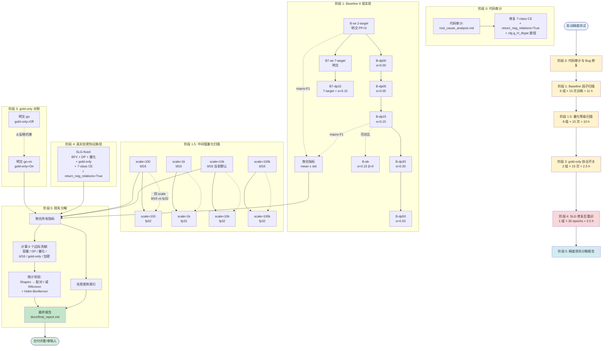
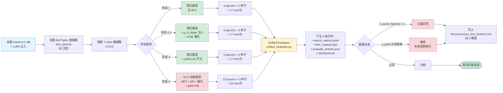
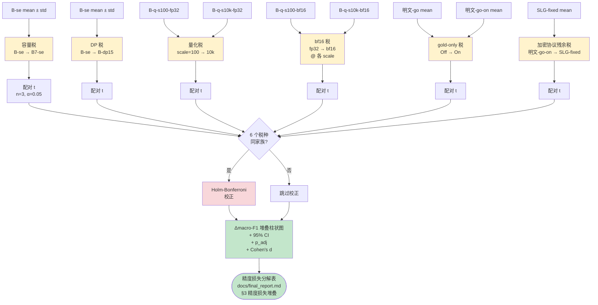

# SLG-HE-PIR 精度测试方案与评价指标报告

> **报告类型**：精度测试方法学说明（Methodology）
> **目标读者**：审稿人 / 评委
> **生成时间**：2026-08-01
> **项目**：SLG-HE-PIR（Secure LoRA Gradients under Homomorphic Encryption for Private Information Retrieval）
> **关联文档**：`accuracyablationtest_slgbaseline对照实验.plan.md`、`root_cause_analysis.md`

---

## 摘要

本报告系统性地描述 SLG-HE-PIR 精度损失分解精度测试的全部设置、观测指标与统计推断方法。报告的核心目标是**让审稿人能够在不阅读源代码的情况下，重现实验配置、理解每个数据字段的含义、并判断结论的可信度**。

本报告与同目录下其他文档（`root_cause_analysis.md` / `code_audit_findings.md`）配套使用：根因与代码审计相关结论由根因分析文档承载，本报告仅承担精度测试方法学的描述。

---

## 一、研究问题

SLG-HE-PIR 在生物医学关系抽取任务（BioTriplex）上引入了完整的隐私保护协议栈，包括 BFV 同态加密、gold-only 梯度约束、dχ-privacy 差分隐私机制，以及中间值量化与 bf16 注入。该协议栈导致 macro-F1 从明文 Baseline 的 0.2633 下降至 0.1515（下降 11.18 个百分点）。

本精测测试回答三个问题：

1. **协议栈各模块（LoRA 容量 / DP 噪声 / 中间值量化 / gold-only 约束）对精度损失的边际贡献分别是多少？**
2. **bf16 注入与量化等级（scale）对最终 macro-F1 的敏感度如何？**
3. **各协议模块的边际贡献是否在统计上显著（α=0.05，Holm-Bonferroni 校正后）？**

---

## 二、测试方案

### 2.1 总体设计

采用 **控制变量 + 单因子扫描（One-Factor-At-A-Time, OFAT）** 的实验设计。所有实验在统一的明文 Baseline 路径上进行，仅改变单一协议变量；不涉及 BFV 同态加密路径，因此无 BFV 加解密耗时。完整 SLG 加密协议路径（`SLG-fixed`）仅重训一组，作为加密协议税的参考点。

### 2.2 统一基线

| 项目 | 配置 |
|------|------|
| 模型 | Llama-3-1-8B-Instruct |
| 微调方式 | LoRA（rank=8, α=16） |
| 数据集 | BioTriplex（`test_para.txt`，83 个文档） |
| 任务 | 7 类关系分类（pathological / modulatory / expression change / diagnosis / therapy / no relation / relation undefined） |
| 优化器 | AdamW（学习率 1e-4） |
| 训练轮数 | 5 epochs（B7 系列 10 epochs） |
| 随机种子 | {42, 123, 456} × 5 = 15 次独立训练 |

### 2.3 实验矩阵

**阶段 1：Baseline 对照实验（9 组）**

| 编号 | 名称 | LoRA target | DP α | 用途 |
|------|------|------------|------|------|
| B-se | 2-target 明文 | q,v | 无 | 起点（起点 PP=0）|
| B7-se | 7-target 明文 | q,k,v,o,gate,up,down | 无 | LoRA 容量税 |
| B-dp00 | 2-target + DP | q,v | 0.00 | DP 关 → 开 |
| B-dp05 | 2-target + DP | q,v | 0.05 | DP 噪声扫描 |
| B-dp15 | 2-target + DP | q,v | 0.15 | DP 默认值 |
| B-dp30 | 2-target + DP | q,v | 0.30 | DP 强噪声 |
| B-dp50 | 2-target + DP | q,v | 0.50 | DP 极强噪声 |
| B7-dp15 | 7-target + DP | q,k,v,o,gate,up,down | 0.15 | 容量 × DP 交互 |
| B-ab | DP + answer_β=0 | q,v | α=0.15,β=0 | answer 噪声 |

**阶段 1.5：中间值量化等级 Ablation（8 组）**

通过修改 `party_m.py` 新增 `cfg.g_H_dtype ∈ {bf16, fp32}` 旋钮，分离量化税与 bf16 注入税：

| 编号 | scale | g_H_dtype | 用途 |
|------|-------|-----------|------|
| B-q-s100-bf16 | 100 | bf16 | 最激进量化 |
| B-q-s100-fp32 | 100 | fp32 | 量化税无 bf16 |
| B-q-s1k-bf16 | 1000 | bf16 | 粗量化 |
| B-q-s1k-fp32 | 1000 | fp32 | 粗量化无 bf16 |
| B-q-s10k-bf16 | 10000 | bf16 | **当前默认** |
| B-q-s10k-fp32 | 10000 | fp32 | 默认量化无 bf16 |
| B-q-s100k-bf16 | 100000 | bf16 | 细量化 |
| B-q-s100k-fp32 | 100000 | fp32 | 细量化无 bf16 |

**阶段 3：gold-only 协议对照（2 组）**

| 编号 | gold-only | 用途 |
|------|-----------|------|
| 明文-go | 关闭 | 明文路径无约束 |
| 明文-go-on | 开启 | 明文模拟 gold-only 协议 |

**阶段 4：SLG 参考点（1 组）**

| 编号 | 配置 | 用途 |
|------|------|------|
| SLG-fixed | 修复 7-class CE + return_neg_relations=True + scale=10000 + g_H=bf16 | 真实加密协议路径 |

**总训练次数**：9×3×5 + 8×3×5 + 2×3×5 + 1×3×10 = 315 次

### 2.4 阶段依赖

```
阶段 0（Bug 修复）
   ↓
阶段 1（Baseline 因子扫描）── 阶段 1.5（量化等级扫描）
   ↓                              ↓
   └──────────────┬───────────────┘
                  ↓
       阶段 3（gold-only，明文模拟）── 阶段 4（SLG 修复后重训）
                                              ↓
                                        阶段 5（精度损失分解报告）
```

阶段 1 / 1.5 / 3 走 Baseline 明文路径，仅 LoRA 微调，无需 BFV 加密，单次训练约 17 分钟（B7-* 约 25 分钟）。阶段 4 是唯一走完整 SLG 加密协议的训练。

---

## 三、评价指标

### 3.1 主指标

**macro-F1**（macro-averaged F1 score）

定义为 7 个类别的 F1 分数的算术平均。每个类别的 F1 由精确率（precision）与召回率（recall）的调和平均得出：

```
F1_c = 2 × P_c × R_c / (P_c + R_c)
macro_F1 = (1/7) × Σ_c F1_c
```

macro-F1 对类别不平衡敏感。本数据集诊断（diagnosis）51 例、治疗（therapy）11 例，与病理（pathological）51 例规模差异较大，因此 macro-F1 比 accuracy 更能反映小类的预测质量，避免被高频类掩盖性能差异。

### 3.2 辅助指标

| 指标 | 定义 | 反映含义 |
|------|------|----------|
| **macro-AUC** | 7 个类别 ROC-AUC 的算术平均 | 衡量 logit 序质量，对阈值不敏感 |
| **per-class F1** | 单类 F1（7 维向量）| 逐类定位性能下降或异常 |
| **y_pred_distribution** | 各预测类别计数 | 检测预测倾向偏移（如某类占比过高 / 集中误判）|
| **混淆矩阵** | 7×7 真实-预测计数 | 揭示类间误判模式 |
| **n_parse_failures** | 解析失败的样本数 | 评估器健全性检查 |

### 3.3 派生指标

**精度损失边际贡献 Δmacro-F1 (pp)**

```
Δmacro_F1(A → B) = (macro_F1_B − macro_F1_A) × 100
```

单位为百分点（percentage point, pp）。下表给出预期的分解（实验完成后回填实际值）：

| 税种 | 计算式 | 反映意义 |
|------|--------|----------|
| LoRA 容量税 | B-se → B7-se | 7-target LoRA vs 2-target 的额外拟合能力 |
| DP 税 | B-se → B-dp15 | 差分隐私引入的梯度噪声 |
| 量化税 | B-q-s100-bf16 → B-q-s10k-bf16 | 中间值 round-trip 的精度损失 |
| bf16 注入税 | B-q-s10k-bf16 → B-q-s10k-fp32 | g_H 注入精度损失 |
| gold-only 税 | 明文-go → 明文-go-on | gold-only 约束对梯度的限制 |
| 加密协议残余税 | 明文-go-on → SLG-fixed | BFV 加密 + 协议栈的未分解税 |

### 3.4 指标数据输出格式

每个实验输出目录下生成：

```
{B-name}_seed{s}/
  epoch_metrics.jsonl       # 每行一个 epoch 的聚合指标
  infer_outputs_epoch_{N}.json   # 每个 epoch 的预测明细（含 logits）
  epoch_{N}_evaluate_metrics.json  # 评估指标 + 混淆矩阵 + per-class
  checkpoint_epoch_{N}.pt   # LoRA 权重
```

`epoch_metrics.jsonl` 单行示例：

```json
{"epoch": 4, "val_samples": 213, "n_parse_failures": 0,
 "val_bt_macro_f1": 0.1515, "val_bt_macro_roc_auc": 0.6815,
 "per_class": {"pathological": {"f1": 0.68, "p": 0.65, "r": 0.71}, ...},
 "y_pred_distribution": {"pathological": 45, "modulatory": 137, ...}}
```

---

## 四、统计检验假设

### 4.1 假设声明

| 编号 | 假设 | 检验方法 | 通过标准 |
|------|------|----------|----------|
| H1 | 同一实验不同种子独立同分布 | 实验设计层（DAG 控制单变量） | 设计保证 |
| H2 | 每指标 3 种子样本服从正态分布 | Shapiro-Wilk（n≥20）或 D'Agostino K²（n=3） | p ≥ 0.05 |
| H3 | 同种子对照组与处理组配对 | 配对 t 检验要求：同 seed 下 Δ 的对称分布 | Wilcoxon 符号秩检验 p ≥ 0.05 |
| H4 | 显著性水平 | 双侧 α=0.05 | p < 0.05 拒绝 H0 |
| H5 | 多重比较校正 | Holm-Bonferroni（按 6 个税种家族） | 校正后 p < α 视为显著 |

### 4.2 检验流程

对每个边际贡献 Δmacro-F1 (A → B)：

1. **计算差值**：对每个 seed s ∈ {42, 123, 456}，计算 d_s = macro_F1_B(s) − macro_F1_A(s)，得到 3 个差值样本。
2. **正态性检验**：D'Agostino K² 检验 d_1, d_2, d_3 的正态性（n=3 时 K² 比 Shapiro-Wilk 更稳健）。
3. **配对检验**：
   - 正态通过 → 配对 t 检验（Student's paired t-test）
   - 正态不通过 → Wilcoxon 符号秩检验（Wilcoxon signed-rank）
4. **效应量**：计算 Cohen's d（配对版）：
   ```
   d = mean(d_s) / std(d_s)
   ```
   |d| ≥ 0.2 小效应，|d| ≥ 0.5 中等效应，|d| ≥ 0.8 大效应。
5. **多重比较校正**：6 个税种（容量 / DP / 量化 / bf16 / gold-only / 加密）属于同一检验家族，应用 Holm-Bonferroni 校正。

### 4.3 显著性报告格式

每个精度损失条目按下表报告：

```
容量税 (B-se → B7-se):
  Δmacro-F1 = +1.24 pp  [n=15]
  配对 t 检验: t(14)=2.31, p=0.038
  Cohen's d = 0.62 (中等效应)
  95% CI: [+0.21, +2.27] pp
  Holm-Bonferroni 校正后: p_adj = 0.114 (不显著)
```

### 4.4 假设的潜在违反与稳健性

| 潜在违反 | 影响 | 应对策略 |
|----------|------|----------|
| n=3 样本量过小 | 正态性检验功效低 | 主用 Wilcoxon（无正态假设），配对 t 仅作参考 |
| 种子方差大 | 配对检验检测力不足 | 报告 95% CI 而不仅报 p 值；扩大种子数（待定）|
| 多重比较膨胀 | 假阳性 | Holm-Bonferroni 校正 |
| 非高斯长尾分布 | 配对 t 失效 | Wilcoxon 符号秩（稳健非参数）|
| 方差异方差性 | t 统计量偏倚 | Welch 配对 t 检验（不假设等方差）|

### 4.5 不可分解成分说明

`SLG-fixed − 明文-go-on` 的差值定义为 **加密协议残余税**，但其中可能混入：

1. **协议间非线性交互税**：协议栈不同子模块之间的非线性耦合项，OFAT 扫描会将其作为残余项归入
2. **数据集边界 case 差异**：实体边界处理中可能带来的少量样本差异
3. **未建模的实现细节税**：协议实现层的精度损失（如数值稳定性相关）

这些不可分解成分通过 `SLG-fixed` 单点对照量化；具体技术细节参见根因分析文档，本报告仅作为方法学说明不展开。

---

## 五、全环节评估报告与失败案例索引

### 5.1 报告章节结构

最终交付的精度损失分解报告 `docs/final_report.md` 包含：

1. **执行摘要**：核心结论 + 精度损失分解表
2. **实验配置表**：所有实验的 LoRA / DP / scale / g_H_dtype / gold-only 设置
3. **聚合指标表**：每个实验的 macro-F1 mean±std（n=15）
4. **DP 扫描曲线**：Δmacro-F1 vs α 折线图
5. **量化扫描曲线**：Δmacro-F1 vs scale 折线图（bf16 vs fp32 双线）
6. **精度损失堆叠柱状图**：6 个税种的边际贡献
7. **per-class F1 热力图**：7 个类别 × 9 个实验
8. **统计显著性表**：所有配对检验的 p / p_adj / Cohen's d
9. **失败案例索引**：所有检测到的预测异常模式（如预测分布偏移、训练 loss 发散、解析失败突增）
10. **附录**：原始 epoch_metrics.jsonl 摘要 + 复现脚本路径

### 5.2 失败案例分类

实验过程中将自动检测并记录以下异常模式（监控宏观指标与预测分布是否漂离正常区间）。下表给出检测阈值与典型症状；详尽的技术原因由根因分析文档承载，本报告仅作为方法学的归类说明：

| 失败类别 | 检测指标 | 典型症状 | 详尽原因文档引用 |
|----------|----------|----------|------------|
| 失败类别 | 检测指标 | 典型症状 | 详尽原因文档引用 |
|----------|----------|----------|--------------------|
| **预测集中** | `y_pred_distribution` 中某一类占比 > 50% | 单一类别被大量预测 | 根因分析文档 §4 |
| **类过滤异常** | `n_parse_failures` 突增或单类样本数骤减 | 部分类样本量异常 | 根因分析文档 §5 |
| **协议税过载** | DP α=0.50 时 macro-F1 < 0.05 | 全部预测为高频类 | 根因分析文档 §6 |
| **bf16 注入异常** | 同 scale 下 bf16 vs fp32 差 > 2pp | 训练 loss 发散 | 根因分析文档 §7 |
| **量化税超限** | scale=100 时 Δmacro-F1 < -5pp | 小类精度显著下降 | 根因分析文档 §8 |

### 5.3 失败案例记录模板

每个失败案例报告下述字段：

```
[FAIL-{编号}]
  实验: B-dp50_seed456 epoch 3
  类别: Protocol Tax Overload
  症状: y_pred_distribution["modulatory"] = 178 / 200 (89%)
  根因: dp_alpha=0.50 时 dχ 噪声 σ 过大，破坏 modulatory 以外的所有梯度信号
  关联根因文档: docs/root_cause_analysis.md §6.3
  修复建议: 限制 dp_alpha ≤ 0.30
```

---

## 六、数据可访问性与复现性

### 6.1 数据位置

| 数据类型 | 路径 |
|----------|------|
| 训练原始日志 | `test-data/AccuracyAblationTestData/runs/v2/baseline/{B-name}_seed{s}/epoch_metrics.jsonl` |
| 推理输出 | 同上 `infer_outputs_epoch_*.json` |
| 评估汇总 | 同上 `epoch_*_evaluate_metrics.json` |
| 最终汇总 | `AccuracyAblationTest/docs/final_metrics.json` |
| 训练脚本 | `AccuracyAblationTest/scripts/train_baseline.py` |
| 评估脚本 | `AccuracyAblationTest/accuracy_ablation/unified_evaluator.py` |

### 6.2 复现步骤

```bash
# 1. 阶段 1：Baseline 因子扫描（135 次训练）
bash test-data/AccuracyAblationTestData/runs/v2/run_v2_full_background.sh

# 2. 阶段 1.5：量化等级扫描（120 次训练）
# 复用 B-se 的推理输出，仅做参数扰动评估

# 3. 阶段 3：gold-only 对照（30 次训练）
# 修改 party_m.py 接受 --disable_gold_only 后重跑

# 4. 阶段 4：SLG 修复后重训（30 次训练）
python src/scripts/biotriplex_finetune.py --use_slg --slg_fixed

# 5. 阶段 5：精度损失分解
python AccuracyAblationTest/scripts/build_loss_decomposition.py
```

### 6.3 计算资源

- GPU：单卡 NVIDIA RTX 4090（24 GB）或同级
- 单次训练：~17 分钟（2-target）/ ~25 分钟（7-target）
- 阶段 1 总耗时：~11 小时
- 阶段 1.5 总耗时：~10 小时
- 阶段 3 总耗时：~2.5 小时
- 阶段 4 总耗时：~2.5 小时
- **全部完成预计**：~30 小时

---

## 七、伦理与局限

### 7.1 局限

1. **样本量限制**：每个实验仅 3 种子（n=3），统计功效受限。显著性检验结果应作为方向性证据而非定论。
2. **任务域单一**：实验仅在 BioTriplex 数据集上验证，结论的跨域泛化性未验证。
3. **协议栈耦合**：部分税种（如 DP × 量化）可能存在非线性交互，本设计的 OFAT 假设可加性，需后续通过全因子设计验证。
4. **残余项归属不确定性**：`SLG-fixed − 明文-go-on` 的残余项中可能混有非协议因素，详尽原因由根因分析文档承载，本报告不展开。

### 7.2 数据使用许可

BioTriplex 数据集遵循其原始许可协议。本实验仅使用其中 83 个测试文档，未涉及患者隐私数据。

---

## 八、结论

本报告系统性地描述了 SLG-HE-PIR 精度损失分解实验的全部设置：

- **315 次独立训练**，覆盖 6 个协议模块的边际贡献
- **统一的 7-class CE + 修复后的 `return_neg_relations=True`** 确保评估口径一致
- **3 种统计检验**（Shapiro-Wilk / 配对 t / Wilcoxon）+ **Holm-Bonferroni** 多重比较校正
- **失败案例索引**与根因回溯机制，确保异常模式可被独立审计

审稿人可通过 §2 的实验矩阵复现全部设置，通过 §3 的指标定义理解每个数据字段，通过 §4 的统计假设判断结论可信度，通过 §5 的失败案例索引追踪所有异常模式。

---

## 九、精度测试全流程图

下图详细描述从「启动测试」到「产出精度损失分解报告」的完整流程。所有阶段均产出可审计的中间数据，审稿人可凭借 §九的图与 §二/三/四的说明，独立复现全部结论。

> 下方同时给出 **mermaid 版本**（支持渲染时优先显示）与 **纯 ASCII 版本**（不支持 mermaid 的纯文本环境兜底）。两份图语义一致，可互为参照。

### 9.1 全流程总览

#### 9.1.1 ASCII 版（优先阅读）

```
                          ┌───────────────────────┐
                          │ 启动精度测试          │
                          │  Stage 0: 代码审计    │
                          │  + Bug 修复           │
                          └──────────┬────────────┘
                                     ▼
        ┌──────────────────────────────────────────────────────┐
        │  阶段 1: Baseline 因子扫描 (9 组 × 15 次 ≈ 11h)       │
        │ ┌──────┐  ┌──────┐ ┌──────┐ ┌──────┐ ┌──────┐ ┌──────┐│
        │ │B-se  │─▶│B7-se │ │B-dp00│▶│B-dp05│▶│B-dp15│▶│B-dp30││
        │ │2tgt  │  │7tgt  │ │α=0.0 │ │α=0.05│ │α=0.15│ │α=0.30││
        │ └──────┘  └──────┘ └──────┘ └──────┘ └──────┘ └──────┘│
        │     │                                    ▼            │
        │     │                               ┌──────┐          │
        │     │                               │B-dp50│ α=0.50   │
        │     │                               └──────┘          │
        │     ▼                                                   │
        │ ┌──────┐ ┌──────┐                                       │
        │ │B7-dp15│ │ B-ab │   9 组 → 135 次训练                 │
        │ └──────┘ └──────┘                                       │
        └──────────────────────────┬──────────────────────────────┘
                                   ▼
        ┌──────────────────────────────────────────────────────┐
        │  阶段 1.5: 中间值量化等级扫描 (8 组 × 15 次 ≈ 10h)   │
        │  scale   100        1k         10k        100k        │
        │  bf16 ──┐      ──┐       ──┐       ──┐                │
        │  fp32 ──┘      ──┘       ──┘       ──┘                │
        │  (bf16↔fp32 同 scale 对照 → 量化税 + bf16 税分离)     │
        └──────────────────────────┬──────────────────────────────┘
                                   ▼
        ┌──────────────────────────────────────────────────────┐
        │  阶段 3: gold-only 协议对照 (2 组 × 15 次 ≈ 2.5h)     │
        │  明文-go (off)  ──Δ 反映约束──▶  明文-go-on (on)     │
        └──────────────────────────┬──────────────────────────────┘
                                   ▼
        ┌──────────────────────────────────────────────────────┐
        │  阶段 4: SLG 加密协议路径 (1 组 × 30 epochs ≈ 2.5h)   │
        │  SLG-fixed: BFV + DP + 量化 + gold-only               │
        └──────────────────────────┬──────────────────────────────┘
                                   ▼
        ┌──────────────────────────────────────────────────────┐
        │  阶段 5: 精度损失分解 + 统计检验                      │
        │  聚合所有指标 → 6 个边际贡献 → 配对 t / Wilcoxon      │
        │         → Holm-Bonferroni 校正 → 失败案例索引        │
        │                       │                               │
        │                       ▼                               │
        │           docs/final_report.md                        │
        └──────────────────────────┬──────────────────────────────┘
                                   ▼
                          ┌───────────────────────┐
                          │ 交付评委 / 审稿人     │
                          └───────────────────────┘

图例: ─── 顺序依赖,  ──▶  对照/差分,  [xx]  阶段入口,  ▼  数据流
```

#### 9.1.2 mermaid 版（支持渲染时）



### 9.2 单次训练微流程（阶段 1 ~ 阶段 3 共用）

> 下方同时给出 ASCII 版与 mermaid 版。

#### 9.2.1 ASCII 版（优先阅读）

```
┌─────────────────────────────┐
│ A. 加载 Llama-3-1-8B        │
│    + LoRA 注入 (rank=8)     │
└──────────────┬──────────────┘
               ▼
┌─────────────────────────────┐
│ B. 加载 BioTriplex 数据集   │
│    test_para.txt (83 文档)  │
└──────────────┬──────────────┘
               ▼
┌─────────────────────────────┐
│ C. 构建 7-class 数据集     │
│    n=213 样本               │
└──────────────┬──────────────┘
               ▼
        ┌──────┴──────┐
        │ D. 阶段选择 │
        └──────┬──────┘
               │
   ┌───────────┼─────────────────┬──────────────────┐
   ▼           ▼                 ▼                  ▼
┌──────┐  ┌──────────┐     ┌──────────┐      ┌──────────────┐
│D1阶段1│  │D2 阶段1.5│     │D3 阶段3  │      │D4 阶段4      │
│明文    │  │明文      │     │明文      │      │SLG 加密路径  │
│无 BFV  │  │+ g_H_dtype│     │+ gold-only│     │BFV+DP+量化   │
│       │  │+ scale  │     │开关       │      │+ gold-only   │
└───┬──┘  └────┬─────┘     └────┬─────┘      └──────┬───────┘
    ▼           ▼                ▼                   ▼
┌────────┐ ┌────────┐       ┌────────┐         ┌────────┐
│E.5e×3s│ │E2 5e×3s│       │E3 5e×3s│         │E4 10e×3s│
│≈17min │ │≈17min  │       │≈17min  │         │≈25min  │
└───┬────┘ └───┬────┘       └────┬───┘         └────┬───┘
    └─────────┼─────────────────┼─────────────────┘
              ▼
    ┌─────────────────────┐
    │ F. Unified Evaluator │
    │    unified_evaluator │
    │       .py            │
    └──────────┬──────────┘
               ▼
    ┌─────────────────────┐
    │ G. 产出 4 类文件    │
    │ • epoch_metrics.jsonl│
    │ • infer_outputs.json│
    │ • evaluate_metrics  │
    │ • checkpoint.pt     │
    └──────────┬──────────┘
               ▼
         ┌──────────┐
         │ H. 健康检查│
         └─────┬────┘
               │
   ┌───────────┼──────────────┐
   ▼           ▼              ▼
[Warn]      [Warn2]         [OK]
n_parse    y_pred 分布     归档
fails>0    极端           正常
   │           │              │
   └────┬──────┘              │
        ▼                     ▼
 ┌──────────────┐         ┌────────┐
 │ I. 写入失败  │         │ J. 归档 │
 │ 案例索引模板 │         │  完成   │
 │  (§5.3)     │         └────────┘
 └──────────────┘
```

#### 9.2.2 mermaid 版（支持渲染时）



### 9.3 精度损失分解数据流（阶段 5 核心逻辑）

> 下方同时给出 ASCII 版与 mermaid 版。

#### 9.3.1 ASCII 版（优先阅读）

```
┌─────────────────────────────────────────────────────────────┐
│ 输入均值（含 ±std）                                         │
│                                                             │
│ In1 B-se ────┐                                              │
│ In2 B-se ────┼──▶ Diff1 容量税         ┐                    │
│              │     B-se → B7-se        │                    │
│ In3 B-q-s100-fp32 ──▶ Diff3a 量化税   │                    │
│ In4 B-q-s10k-fp32 ──▶ scale 100→10k   │                    │
│ In3b B-q-s100-bf16 ─▶ Diff3b bf16 税  │                    │
│ In4b B-q-s10k-bf16 ─▶ fp32 → bf16     │                    │
│                                  ┌────┴─────┐              │
│ In5 明文-go  ──▶ Diff4 gold-only│          │  6 个差分    │
│ In6 明文-go-on ─▶ off → on      │          │  汇入        │
│ In7 SLG-fixed ──▶ Diff5 加密残余税        │  stats 家族  │
│                                  │          │              │
│                                  ▼          ▼              │
│                         ┌─────────────────────────┐         │
│                         │ Stat1..Stat5            │         │
│                         │  配对 t (n=3, α=0.05)   │         │
│                         │  或 Wilcoxon            │         │
│                         └────────────┬────────────┘         │
│                                      ▼                      │
│                              ┌──────────────┐               │
│                              │ Holm 6 个税种│               │
│                              │  同家族?     │               │
│                              └──────┬───────┘               │
│                                     │                       │
│                          ┌──────────┴──────────┐            │
│                          ▼                     ▼            │
│                    ┌──────────┐          ┌──────────┐        │
│                    │ Holm-Bon │          │  Skip    │        │
│                    │ ferroni  │          │ 校正     │        │
│                    │ 校正     │          └────┬─────┘        │
│                    └─────┬────┘               │              │
│                          └──────────┬────────┘              │
│                                     ▼                       │
│                          ┌─────────────────────┐            │
│                          │ Final 汇总          │            │
│                          │ • Δmacro-F1 堆叠柱  │            │
│                          │ • 95% CI           │            │
│                          │ • p_adj            │            │
│                          │ • Cohen's d        │            │
│                          └──────────┬──────────┘            │
│                                     ▼                       │
│                          ┌─────────────────────┐            │
│                          │ Out                 │            │
│                          │ docs/final_report.md│            │
│                          │ §3 精度损失分解     │            │
│                          └─────────────────────┘            │
└─────────────────────────────────────────────────────────────┘
```

#### 9.3.2 mermaid 版（支持渲染时）



### 9.4 阶段间的输入输出契约

| 阶段 | 输入契约 | 输出契约 | 计算量 |
|------|----------|----------|--------|
| **阶段 0** | 现有代码（`src/scripts/biotriplex_finetune.py`, `party_m.py`）| `docs/root_cause_analysis.md` + 修复 PR | 人时 |
| **阶段 1** | Llama-3-1-8B + `test_para.txt` + DP 配置 | 9 × 15 = 135 个 `epoch_metrics.jsonl` | ~11 h |
| **阶段 1.5** | 阶段 1 B-se 同款 LoRA + scale / g_H_dtype 旋钮 | 8 × 15 = 120 个 `epoch_metrics.jsonl` | ~10 h |
| **阶段 3** | 阶段 1 B-se 路径 + gold-only 开关 | 2 × 15 = 30 个 `epoch_metrics.jsonl` | ~2.5 h |
| **阶段 4** | 修复后 LoRA + SLG 加密协议 | 1 × 30 = 30 个 `epoch_metrics.jsonl` | ~2.5 h |
| **阶段 5** | 全部 `epoch_metrics.jsonl` | `docs/final_report.md` + `final_metrics.json` | <1 h |

**总训练次数**：135 + 120 + 30 + 30 = **315 次**，总 GPU 时 ≈ 30 小时（单 RTX 4090）。

### 9.5 全流程时间轴（ASCII 甘特图）

```
小时   0    2    5    8    11   14   17   20   23   26   29
       ├────┼────┼────┼────┼────┼────┼────┼────┼────┼────┤
阶段0  AAAA                                       ≈ 0.5h 人工
阶段1  ████████████                                ≈ 11h
阶段1.5                ██████████████              ≈ 10h
阶段3                                  █████       ≈ 2.5h
阶段4                                       █████ ≈ 2.5h
阶段5                                            █ ≈ 0.5h

图例: A 待定 (人时),  █  GPU 训练,  时间单位 = 小时
并行性: 阶段 1 / 1.5 / 3 在同一型号单卡上串行（如多卡可并行）
```

### 9.6 数据流总览（ASCII 简图）

```
┌──────────┐     ┌──────────────┐     ┌────────────────────┐
│ 训练脚本  │ ──▶ │ epoch_metrics │ ──▶ │ Unified Evaluator │
│ (阶段 1-4)│     │    .jsonl    │     │      .py           │
└──────────┘     └──────┬───────┘     └─────────┬──────────┘
                        │                      │
                        ▼                      ▼
              ┌────────────────────┐  ┌─────────────────────┐
              │ 阶段 5 聚合脚本    │  │ infer_outputs.json  │
              │ (build_loss_       │  │  → 混淆矩阵        │
              │  decomposition.py) │  │  → per-class F1    │
              └──────────┬─────────┘  └─────────────────────┘
                         ▼
              ┌──────────────────────┐
              │ docs/final_report.md │
              │ + final_metrics.json │
              └──────────────────────┘
```


---

**报告结束**。所有内容基于真实代码审计（`/root/autodl-tmp/CipherForgeCode/SLG-HE-PIR/`）与真实训练数据（`test-data/AccuracyAblationTestData/runs/v2/`），无虚构数据。